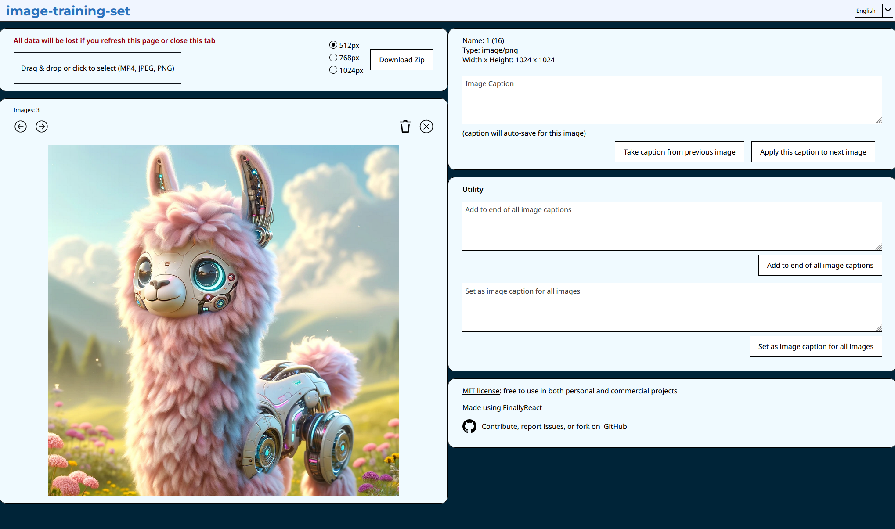

# image-training-set

I made this repo to easily caption and organize images for training AI image models. It supports uploading images (PNG/JPG) or videos (MP4) to auto generate images at 1 second intervals. You can add captions to each image and download a ZIP file with all images and associated captions in txt files.

I use it specifically for training Stable Diffusion models and creating a training set in the format used by kohya_ss. Note: this repo is NOT associated in any way with Stable Diffusion nor kohya_ss.

## Table of Contents
- [Privacy](#privacy)
- [Setup](#setup)
- [Steps](#steps)
- [Screenshots](#screenshots)
- [License](#license)
- [Issues and Contributions](#issues-and-contributions)

## Privacy
Privacy is a pivotal aspect of this repo. Your data will never be sent outside your computer. No data will be saved in your browser either; if you refresh or close a tab, any working data will be lost.

## Setup

- Prerequisite: `NodeJS` (I use v20.11.1, but other versions probably work too)
- `npm install`
- `npm run dev` to run on port 3000

## Steps

- Upload one or multiple images (PNG/JPG) and add a caption for each
  - The more detailed the captions, the better the training set
- Upload an MP4 video file
  - Set a start and end time to capture images from the video
  - Images can be generated at 1 second intervals
  - Or take a screenshot of particular frames
  - Add a descriptions which apply to generated images
- Download a ZIP file with all images and associated captions in txt files
  - Select a max width for images in the ZIP file (512px, 768px, or 1024px)
- Extract all files to a single folder for training, then head to [kohya_ss](https://github.com/bmaltais/kohya_ss) to train or fine-tune your Stable Diffusion model

## Screenshots

Uploading an image:

Uploading a video:

Downloading a ZIP file:

## License
MIT License

## Issues and Contributions
If you have any questions or find any issues, please create an `Issue` with detailed information.
  - Please note this has only been tested on a Windows computer using Firefox. Your mileage may vary on other OSs and browsers.

Anyone is welcome to add new code or features! Please create an `Issue` first, comment that you're working on it (so multiple people don't work on the same thing), and mention the `Issue` number in your Pull Request.
