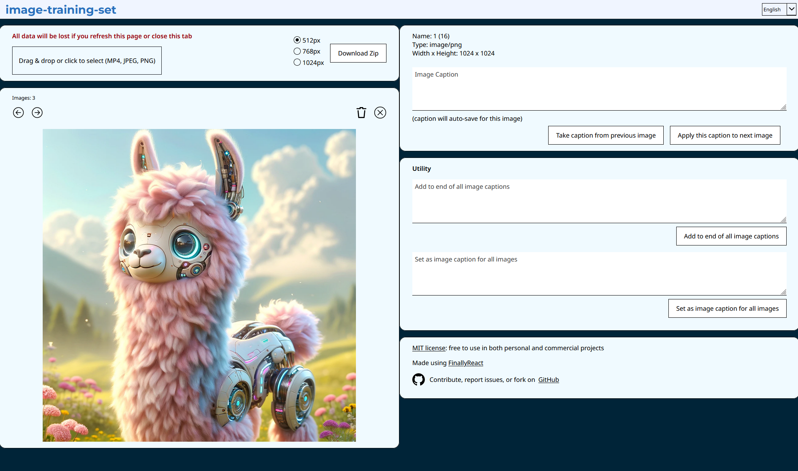
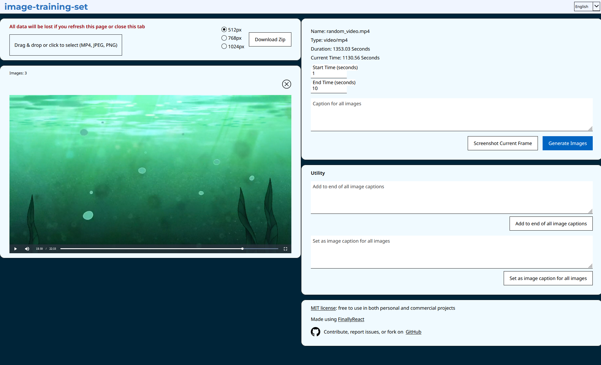
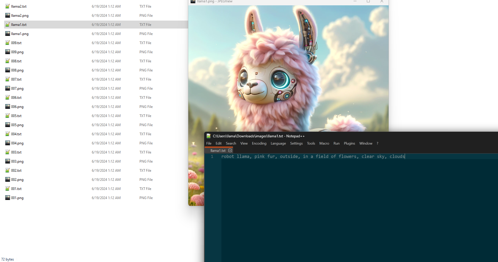

# image-training-set

このリポジトリは、画像モデルのトレーニングのために画像にキャプションを付けて整理するために作成しました。画像（PNG/JPG）や動画（MP4）をアップロードして、1秒間隔で自動的に画像を生成することができます。各画像にキャプションを追加し、すべての画像と関連するキャプションが入ったZIPファイルをダウンロードできます。

私はこれを特にStable Diffusionモデルのトレーニングやkohya_ss形式のトレーニングセット作成に使用しています。注意：このリポジトリはStable Diffusionやkohya_ssとは一切関係ありません。

## 目次
- [プライバシー](#プライバシー)
- [セットアップ](#セットアップ)
- [手順](#手順)
- [スクリーンショット](#スクリーンショット)
- [ライセンス](#ライセンス)
- [問題と貢献](#問題と貢献)

## プライバシー
プライバシーはこのリポジトリの重要な側面です。データは決してコンピュータの外部に送信されません。また、データはブラウザにも保存されません。タブをリフレッシュしたり閉じたりすると、作業中のデータは失われます。

## セットアップ

- 前提条件: `NodeJS`（私はv20.11.1を使用していますが、他のバージョンでも動作すると思います）
- `npm install`
- `npm run dev` でポート3000で実行

## 手順

- 一つまたは複数の画像（PNG/JPG）をアップロードし、それぞれにキャプションを追加
  - キャプションは詳細であればあるほど、トレーニングセットが良くなる
- MP4動画ファイルをアップロード
  - 動画から画像をキャプチャするための開始時間と終了時間を設定
  - 1秒間隔で画像を生成することも可能
  - または特定のフレームのスクリーンショットを撮る
  - 生成された画像に適用される説明を追加
- すべての画像と関連キャプションを含むZIPファイルをダウンロード
  - ZIPファイルの画像の最大幅を選択（512px、768px、または1024px）
- トレーニングのためにすべてのファイルを単一のフォルダーに抽出し、[kohya_ss](https://github.com/bmaltais/kohya_ss)でStable Diffusionモデルをトレーニングまたは微調整する

## スクリーンショット

画像のアップロード:

動画のアップロード:

ZIPファイルのダウンロード:

## ライセンス
MITライセンス

## 問題と貢献
質問や問題がある場合は、詳細情報を記載した`Issue`を作成してください。
  - これはWindowsコンピュータでFirefoxを使用してのみテストされています。他のOSやブラウザでは動作が異なる可能性があります。

誰でも新しいコードや機能を追加できます！最初に`Issue`を作成し、取り組んでいることをコメント（複数の人が同じことに取り組まないように）し、Pull Requestに`Issue`番号を記載してください。
