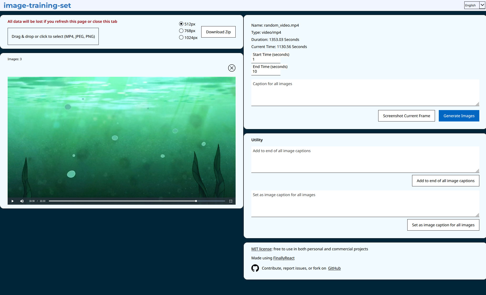
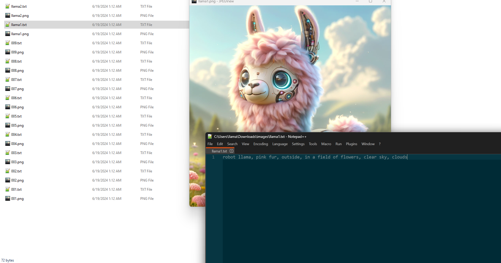

# image-training-set

이 리포지토리는 이미지 모델 훈련을 위해 이미지를 쉽게 캡션하고 정리하기 위해 만들었습니다. 이미지를 업로드(PNG/JPG)하거나 동영상을 업로드(MP4)하여 1초 간격으로 자동으로 이미지를 생성할 수 있습니다. 각 이미지에 캡션을 추가하고 모든 이미지와 관련 캡션이 포함된 ZIP 파일을 다운로드할 수 있습니다.

저는 주로 Stable Diffusion 모델을 훈련하고 kohya_ss 형식의 훈련 세트를 만드는 데 사용합니다. 참고: 이 리포지토리는 Stable Diffusion 또는 kohya_ss와 전혀 관련이 없습니다.

# 목차
- [개인정보](#개인정보)
- [설정](#설정)
- [단계](#단계)
- [스크린샷](#스크린샷)
- [라이선스](#라이선스)
- [문제 및 기여](#문제및기여)

## 개인정보
개인정보는 이 리포지토리의 중요한 측면입니다. 데이터는 절대로 컴퓨터 외부로 전송되지 않습니다. 또한 브라우저에 데이터가 저장되지 않습니다. 탭을 새로 고치거나 닫으면 작업 중인 데이터는 모두 손실됩니다.

## 설정

- 전제 조건: `NodeJS`(저는 v20.11.1을 사용하지만, 다른 버전도 작동할 것입니다)
- `npm install`
- `npm run dev`로 포트 3000에서 실행

## 단계

- 하나 이상의 이미지(PNG/JPG)를 업로드하고 각 이미지에 캡션 추가
  - 캡션이 자세할수록 훈련 세트가 더 좋음
- MP4 비디오 파일 업로드
  - 비디오에서 이미지를 캡처할 시작 및 종료 시간 설정
  - 1초 간격으로 이미지 생성 가능
  - 또는 특정 프레임의 스크린샷 찍기
  - 생성된 이미지에 적용될 설명 추가
- 모든 이미지와 관련 캡션이 포함된 ZIP 파일 다운로드
  - ZIP 파일의 이미지 최대 너비 선택 (512px, 768px 또는 1024px)
- 모든 파일을 단일 폴더에 추출하여 훈련에 사용한 다음, [kohya_ss](https://github.com/bmaltais/kohya_ss)로 이동하여 Stable Diffusion 모델을 훈련 또는 미세 조정

## 스크린샷

이미지 업로드:

동영상 업로드:

ZIP 파일 다운로드:

## 라이선스
MIT 라이선스

## 문제및기여
질문이 있거나 문제를 발견하면, 자세한 정보를 포함한 `Issue`를 작성해 주세요.
  - 이것은 Windows 컴퓨터에서 Firefox를 사용하여 테스트되었습니다. 다른 운영 체제 및 브라우저에서는 다르게 동작할 수 있습니다.

누구나 새로운 코드나 기능을 추가할 수 있습니다! 먼저 `Issue`를 작성하고, 작업 중이라는 댓글을 달아주세요(여러 사람이 동일한 작업을 하지 않도록). Pull Request에 `Issue` 번호를 언급해 주세요.
